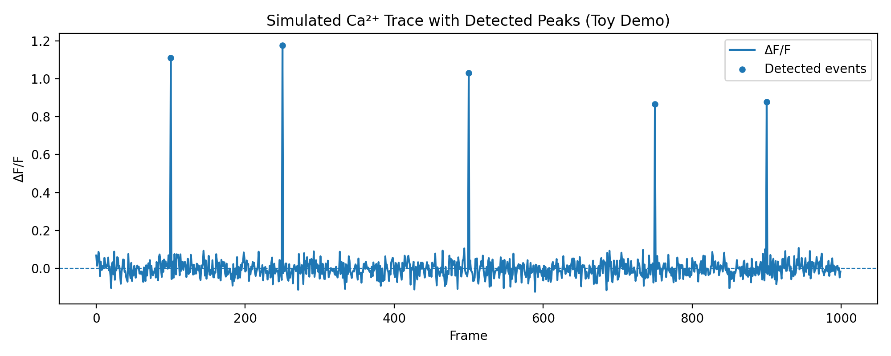

# Neuronal Ca²⁺ Activity — Minimal ΔF/F Pipeline Demo (Toy)

A tiny, beginner-level **end-to-end** demonstration of a calcium-like fluorescence preprocessing workflow:  
**simulate data → compute ΔF/F → detect simple events → export CSVs + generate a QC plot.**

> **Important:** This is a **toy demo on synthetic data** for illustrating analysis habits and reproducibility.  
> It is **not** a biologically valid calcium imaging pipeline and should not be used for real experiments.

---

## What this repo contains / generates

### Code
- `calcium_peaks_demo.py` — runs the full workflow (simulation → ΔF/F → event detection → exports + plot)

### Outputs (generated after running the script)
- `raw_trace_dfF.csv` — per-frame table: `Frame`, `Raw`, `DeltaF/F` (1–1000)
- `events.csv` — detected event frames + values (toy threshold rule)
- `trace_qc.png` — QC-style plot: ΔF/F trace with detected-event markers

### Optional
- `analysis_notebook_en.ipynb` — notebook version of the same workflow (if you include it)

---

## Quick view (QC plot)

If `trace_qc.png` is in the repo root, GitHub will render it here:



---

## Methods (toy, minimal)

### 1) Synthetic data simulation
- Frames: **1000**
- Baseline fluorescence: ~**50 a.u.**
- Noise: Gaussian, **σ = 2**
- Injected events: **5** spikes at approximately frames **100, 250, 500, 750, 900**

### 2) ΔF/F normalization
Baseline fluorescence is estimated as:
- `F0 = mean(first 100 frames)`

Then:
- `ΔF/F = (F - F0) / F0`

### 3) Event detection (simple threshold; intentionally minimal)
Compute:
- `threshold = mean(ΔF/F) + 1.5 × std(ΔF/F)`

Flag frames as events when:
- `ΔF/F > threshold`

> Note: This simplistic rule can mark multiple adjacent frames around one spike and does not implement  
> refractory windows, merging, or prominence/duration filters.

---

## How to run

### Requirements
- Python 3.x
- Packages: `numpy`, `matplotlib`

### Install + run
```bash
pip install numpy matplotlib
python calcium_peaks_demo.py
```

## Limitations / next steps
- Thresholding is minimal; it can flag multiple adjacent frames as events.
- Next steps: peak merging/refractory window, prominence/duration filters, baseline drift handling, and alignment to behavioral timestamps.
